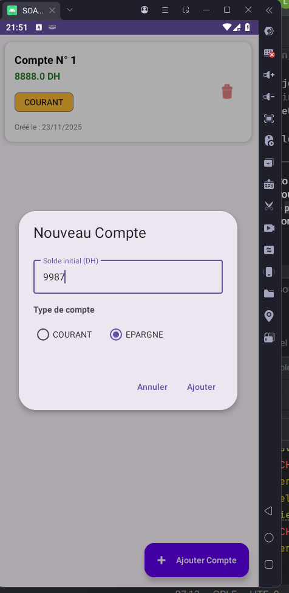
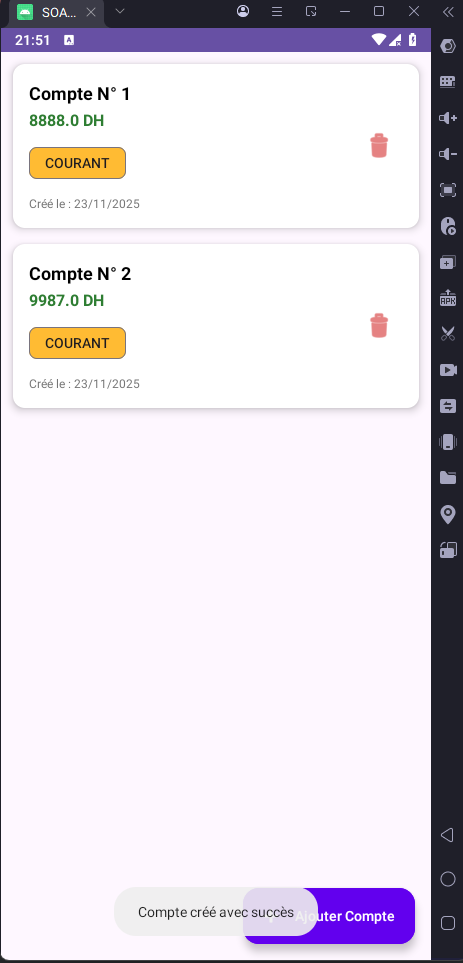

# 📱 Android SOAP Banking App

Une application mobile Android native développée en **Kotlin** qui permet de gérer des comptes bancaires en communiquant avec un service web **SOAP** (backend Spring Boot/CXF).

Ce projet démontre l'intégration du protocole SOAP (via `ksoap2`) dans l'écosystème Android moderne avec une interface Material Design.

## ✨ Fonctionnalités

* **Consultation :** Affichage de la liste des comptes bancaires récupérée depuis le serveur.
* **Création :** Ajout d'un nouveau compte (Solde + Type : Courant/Épargne).
* **Suppression :** Suppression d'un compte existant via l'interface.
* **Communication SOAP :** Gestion des requêtes et réponses XML brutes.
* **Interface Réactive :** Utilisation de `RecyclerView` et `Coroutines` pour la fluidité.
  
  

## 🛠️ Stack Technique

* **Langage :** Kotlin
* **Architecture :** MV (Model-View) simplifiée pour le TP.
* **Réseau :** [ksoap2-android](https://github.com/simpligility/ksoap2-android) (Protocole SOAP).
* **UI :** XML Layouts, Material Design Components, RecyclerView.
* **Concurrency :** Kotlin Coroutines (Dispatchers.IO).
* **Backend requis :** Spring Boot + Apache CXF (Service Web SOAP).

## 📂 Structure du Projet

L'application est organisée en packages clairs :

```
ma.projet.soapclient
├── adapter       # Gestion de l'affichage de la liste (RecyclerView)
│   └── CompteAdapter.kt
├── beans         # Modèles de données (POJO/Data Classes)
│   ├── Compte.kt
│   └── TypeCompte.kt
├── ws            # Logique réseau et parsing SOAP
│   └── Service.kt
└── MainActivity.kt # Contrôleur principal et IHM
```

## ⚙️ Configuration Clé

Pour que l'application fonctionne, deux fichiers sont cruciaux :

### 1\. Configuration Réseau (`Service.kt`)

Le fichier `ws/Service.kt` contient les paramètres de connexion.

* **NAMESPACE :** Doit correspondre exactement au `targetNamespace` du WSDL (ex: `http://ws.demo.example.org/`).
* **URL :**
    * Émulateur Android : `http://10.0.2.2:8080/services/ws`
    * Téléphone Physique : `http://192.168.x.x:8080/services/ws` (IP locale de votre PC).
* **SOAP Action :** Configurée à vide `""` pour la compatibilité avec Apache CXF.

### 2\. Permissions (`AndroidManifest.xml`)

L'application nécessite l'accès à Internet et autorise le trafic HTTP non sécurisé (pour le développement local).

```xml
<uses-permission android:name="android.permission.INTERNET" />
<application
    ...
    android:usesCleartextTraffic="true">
```

## 🚀 Installation et Exécution

1.  **Prérequis Backend :** Assurez-vous que votre serveur Spring Boot SOAP est lancé et accessible (testez le WSDL dans votre navigateur : `http://localhost:8080/services/ws?wsdl`).
2.  **Cloner le projet :**
    ```bash
    git clone https://github.com/votre-username/SOAPCompteApp.git
    ```
3.  **Ouvrir dans Android Studio :**
    * File \> Open \> Sélectionner le dossier du projet.
    * Laissez Gradle synchroniser les dépendances.
4.  **Configurer l'IP :**
    * Ouvrez `Service.kt`.
    * Modifiez la variable `URL` selon votre méthode de test (Émulateur ou Téléphone).
5.  **Lancer l'application :** Cliquez sur le bouton "Run" (▶️).

## 🐛 Résolution de problèmes courants

* **Erreur `SocketTimeout` ou `Connection Refused` :** Vérifiez que votre PC et votre téléphone sont sur le même réseau Wifi et que le pare-feu Windows n'interdit pas le port 8080.
* **Erreur `Unexpected wrapper element` :** Vérifiez que le `NAMESPACE` dans `Service.kt` est identique à celui du serveur.
* **Crash au lancement :** Vérifiez que la permission INTERNET est bien dans le `AndroidManifest.xml` (en dehors de la balise `<application>`).

